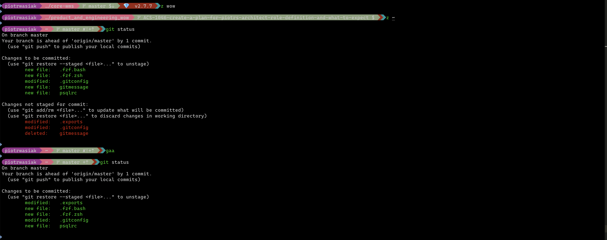
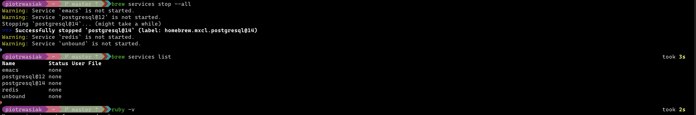

# Dotfiles


## Why would I want my dotfiles on GitHub?
from http://dotfiles.github.io/

* Backup, restore, and sync the prefs and settings for your toolbox. Your dotfiles might be the most important files on your machine.
* Learn from the community. Discover new tools for your toolbox and new tricks for the ones you already use.
* Share what you’ve learned with the rest of us.

## My setup overview
Startship prompt + zsh + [iterm2](https://iterm2.com/features.html) (mac os)

## Screenshots
Current setup:




Powerlevel:


## Included
- [Starship](https://starship.rs) Rust compatible with many shells prompt. 
I picked up [pastel powerline](https://starship.rs/presets/#pastel-powerline) theme , and disabled time as I don't use full screen so much in terminal (not vim poweruser)
Before I installed [powerlevel10k](https://github.com/romkatv/powerlevel10k) which is decent option also.
- ruby/rails setup and console enhancements
- ~asdf~ mise to manage language versions of ruby/node etc
- brew integration
- fzf integration, replacing search in shell history and fast jumps
- psql prompt setup from thoughbot dotfiles
- zsh history limits are bumped, stored with timestamps and remove duplicates
- visual studio code set as debugger editor (in .exports)
- bat for git diff (cat on steroids)
- eza replaces ls, with community aliases

I resigned from omzh and load all scripts by myself:
zsh-syntax-highlighting
zsh-autosuggestions
zsh-completions
z (jump to the most used locations by ex: project name)

## Convention
- store creds with exports @ ~/.creds outside of the repo (security reason)
- define aliases @ ~/.aliases
- define common exports @ ~/.exports

## Ruby extensions
- Define object _#local_methods_ to list only defined there methods
- copy(str) to clipboard
- paste from clipboard to console (fast for long texts, causing terminal slow paste)
- AwesomePrint Hash formatter for hashes (I have to switch to [amazing_print](https://github.com/amazing-print/amazing_print)). AwesomePrint setup @ .aprc
- pry history enabled, prompt adjusted to rails

## Way of maintaining my dotfiles
Managing dotfiles with git initiated in home folder (~). Ignoring all files and adding them with --force option:
https://drewdevault.com/2019/12/30/dotfiles.html

## Tools installation

Warning: If you want to give these dotfiles a try, you should first fork this repository, review the code, and remove things you don’t want or need. Don’t blindly use my settings unless you know what that entails. Use at your own risk!

Brew and packages can be installed with: `~/dotfiles/brew_install.sh`
Mac os first setup: `~/.config/macos_setup.sh`

For developing I use [Hack](https://github.com/source-foundry/Hack) font.
In terminal: [CaskaydiaCove Nerd Font](https://github.com/ryanoasis/nerd-fonts/tree/master/patched-fonts/CascadiaCode)
```bash
brew install --cask font-hack-nerd-font
brew install --cask font-caskaydia-cove-nerd-font
```

VSCode config has to be symlinked: `ln -s ~/.config/VSCode/settings.json ~/Library/Application\ Support/Code/User/settings.json`

## Issues
- none

## My findings about OhMyPosh
- completition in zsh did not work well (prompt was jumping to center of the screen). Beside that it seemed to be quite good project
