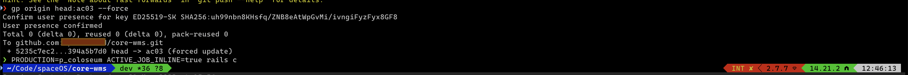

# Dotfiles

## Why would I want my dotfiles on GitHub?
from http://dotfiles.github.io/

* Backup, restore, and sync the prefs and settings for your toolbox. Your dotfiles might be the most important files on your machine.
* Learn from the community. Discover new tools for your toolbox and new tricks for the ones you already use.
* Share what you’ve learned with the rest of us.

## My setup overview
Startship prompt + zsh + [iterm2](https://iterm2.com/features.html) (mac os)

## Screenshots
Current setup:

Powerlevel:

## Included
- [Starship](https://starship.rs) Rust compatible with many shells prompt. 
I picked up [pastel powerline](https://starship.rs/presets/#pastel-powerline) theme , and disabled time as I don't use full screen so much in terminal (not vim poweruser)
Before I installed [powerlevel10k](https://github.com/romkatv/powerlevel10k) which is decent option also.
- ruby/rails setup and console enhancements
- asdf to manage language versions of ruby/node etc
- brew integration
- fzf integration, replacing search in shell history and fast jumps
- psql prompt setup from thoughbot dotfiles
- zsh history limits are bumped, stored with timestamps and remove duplicates
- visual studio code set as debugger editor (in .exports)
- bat for git diff (cat on steroids)

I resigned from omzh and load all scripts by myself:
zsh-syntax-highlighting
zsh-autosuggestions
zsh-completions
z (jump to the most used locations by ex: project name)

## Convention
- store creds with exports @ ~/.creds outside of the repo (security reason)
- define aliases @ ~/.aliases
- define common exports @ ~/.exports

## Ruby extensions
- Define object #local_methods to list only defined there methods
- copy(str) to clipboard
- paste from clipboard to console (fast for long texts, causing terminal slow paste)
- AwesomePrint Hash formatter for hashes (I have to switch to [amazing_print](https://github.com/amazing-print/amazing_print)). AwesomePrint setup @ .aprc
- pry history enabled, prompt adjusted to rails

## Way of maintaining my dotfiles
Managing dotfiles with git initiated in home folder (~). Ignoring all files and adding them with --force option:
https://drewdevault.com/2019/12/30/dotfiles.html

## Tools installation
I did not provided script to install required libs from brew. It's on my todo list. I install them with brew.

## My findings about OhMyPosh
- completition in zsh did not work well (prompt was jumping to center of the screen). Beside that it seemed to be quite good project